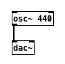
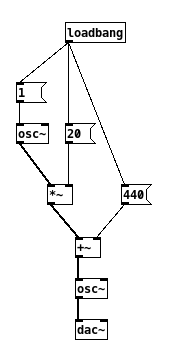

xipd is a programming language for audio processing that compiles to
[PureData](http://msp.ucsd.edu/Pd_documentation/index.htm).

## Example

```
include "std.xipd"

osc(freq) {
    osc = `osc~`
    freq -> osc
    return osc
}

osc1 = osc(1)
osc2 = osc(osc1 *~ 20 +~ 440)
osc2 -> `dac~`
```

## PureData Primer

PureData is a graphical programming environment for real-time audio processing.
It consists of *nodes* and *connections*. For example, there could be one
oscillator node, one node for audio output, and a connection between them.



There are two kinds of connections: *control* connections for sporadic messages
and *signal* connections for continuous streams. Nodes that expect signal
connections are usually suffixed with "~". For example, the `+` node can be
used to add two numbers, but if you want to mix audio streams you have to use
`+~` instead.

Nodes can have multiple *inlets* and *outlets*. For example, the `+` node has
two inlets. The value of a node is only updated when it receives a message to
its first inlet. The first inlet is therefore referred to as *hot* while the
others are called *cold*.

PureData comes with a large set of built-in nodes for low-level audio
processing. There is also a large community that shares more high-level
structures.

## Goals

I personally had some issues with PureData, so I tried to wrap it in something
that feels more familiar to me. The result of that attempt is xipd. The goals
are:

-   **Text-based instead of visual programming language**: This is crucial so
    authors can use common tools like vim or git. PureData does have a [text
    representation](http://puredata.info/docs/developer/PdFileFormat), but it is
    not really meant for humans.
-   **Variables**: In its text representation, PureData references nodes by
    index. I want to use human-readable names instead.
-   **Includes**: In order to structure code, I want to be able to split it into
    several files.
-   **Functions**: With PureData it is common to copy large sets of nodes.
    Instead I want to have functions so that code can be reused in a structured
    way.
-   **Inlets are hot by default**: While I understand that cold inlets are a
    powerful tool for control flow, I found it to be very unintuitive.
-   **Small language, extensive standard library**: The language itself should be
    simple and stable. Over time, a standard library of functions should emerge
    that provides useful abstractions.
-   **Intuitive standard library**: I had a hard time adjusting to the built-in
    nodes. I still don't really understand some of them, while some features that
    I would have expected are missing. I hope that a standard library of
    functions can provide a more intuitive set of primitives by wrapping those
    builtins.
-   **No loss of features**: xipd should be able to express everything that
    PureData can express.

## Features

### Names

Names for functions and variables must consist of upper and lower letters,
digits, and underscores. The first character must not be a digit.

### Expressions

An expression always represents a node combined with a default inlet/outlet. If
no inlet/outlet is provided it always defaults to 0. There are many
different types of expressions:

-   **String**: (e.g. `"foo"`)
-   **Integer**: (e.g. `1`)
-   **Float**: (e.g. `1.0`)
-   **Raw**: a raw PureData object node (e.g. `` `osc~ 440` ``)
-   **Reference**: A variable with an optional explicit inlet/outlet that
    overwrites the default one (e.g. `foo:1`)
-   **Function call**: The arguments can be arbitrary expressions (e.g.
    ``foo(`osc~`, 15)``)
-   **Operator**: (e.g. `foo:1 * 2 + 15`)

### Statements

Each file is parsed line by line. Empty lines and lines starting with `#` are
ignored, as is leading and trailing whitespace. All other lines must match one
of the following patterns:

-   **Assignment**: Assign an expression to a name (e.g. `foo = 1`)
-   **Connection**: Create a connection between two nodes. (e.g. ``foo:1 ->
    `dac~` ``)
-   **Include**: Include code from another file (e.g. `include "../foo.xirb"`)
-   **Start a function**: (e.g. `foo(a, b) {`)
-   **End a function**: Each function must end with `}`
-   **Return**: Each function must return an expression. This should be the
    last statement of the function because no further statements are executed.
    (e.g. `return foo:1`)

## Low-level language

By not using functions and operators you can have a low-level language that is
quite close to the PureData text representation:

```
X1 = 1
X2 = `osc~`
X3 = 20
X4 = `*~`
X5 = 440
X6 = `+~`
X7 = `osc~`
X8 = `dac~`
X1:0 -> X2:0
X2:0 -> X4:0
X3:0 -> X4:1
X4:0 -> X6:0
X5:0 -> X6:1
X6:0 -> X7:0
X7:0 -> X8:0
```



